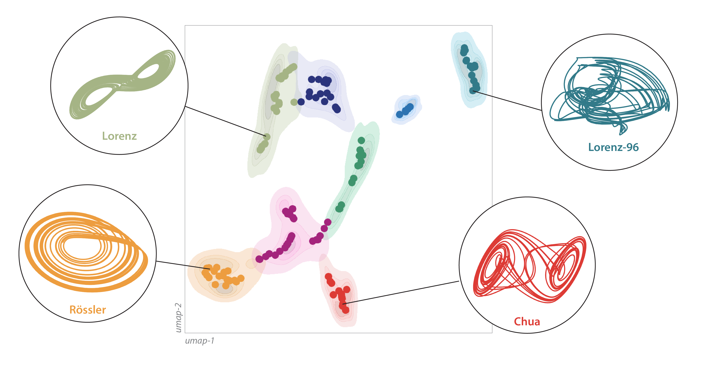

# dysts

Analyze more than a hundred chaotic systems.



## Basic Usage

Import a model and run a simulation with default initial conditions and parameter values
```python
from dysts.flows import Lorenz

model = Lorenz()
sol = model.make_trajectory(1000)
# plt.plot(sol[:, 0], sol[:, 1])
```

Modify a model's parameter values and re-integrate
```python
model = Lorenz()
model.gamma = 1
model.ic = [0.1, 0.0, 5]
sol = model.make_trajectory(1000)
# plt.plot(sol[:, 0], sol[:, 1])
```

Integrate new trajectories from all 135 chaotic systems with a custom granularity
```python
from dysts.base import make_trajectory_ensemble

all_out = make_trajectory_ensemble(100, resample=True, pts_per_period=75)
```

Load a precomputed collection of time series from all 135 chaotic systems
```python
from dysts.datasets import load_dataset

data = load_dataset(subsets="train", data_format="numpy", standardize=True)
```

Additional functionality and examples can be found in [`the demonstrations notebook.`](demos.ipynb). The full API documentation [can be found here](http://www.wgilpin.com/dysts/spbuild/html/index.html).

## Reference

For more information, or if using this code for published work, please consider citing the papers.

> William Gilpin. "Chaos as an interpretable benchmark for forecasting and data-driven modelling" Advances in Neural Information Processing Systems (NeurIPS) 2021 https://arxiv.org/abs/2110.05266

> William Gilpin. "Model scale versus domain knowledge in statistical forecasting of chaotic systems" Physical Review Research 2023 https://arxiv.org/abs/2303.08011

We are very grateful for any suggestions or contributions. See [`CONTRIBUTING.md`](CONTRIBUTING.md)

## Installation

Install from PyPI

    pip install dysts

See the [additional installation guide](#additional-installation-guide) for more options.


## Benchmarks

The benchmarks reported in our preprint can be found in [`benchmarks`](benchmarks/). An overview of the contents of the directory can be found in [`BENCHMARKS.md`](benchmarks/BENCHMARKS.md), while individual task areas are summarized in corresponding Jupyter Notebooks within the top level of the directory.

## Contents

+ Code to generate benchmark forecasting and training experiments are included in [`benchmarks`](benchmarks/)
+ Pre-computed time series with training and test partitions are included in [`data`](dysts/data/)
+ The raw definitions metadata for all chaotic systems are included in the database file [`chaotic_attractors`](dysts/data/chaotic_attractors.json). The Python implementations of differential equations can be found in [`the flows module`](dysts/flows.py)


## Additional Installation Guide

To obtain the latest version, including new features and bug fixes, download and install the project directly from GitHub

    pip install git+https://github.com/williamgilpin/dysts

Test that everything is working

    python -m unittest

To install the optional precomputed trajectories (a large, static dataset), install directly from GitHub

    pip install git+https://github.com/williamgilpin/dysts_data

The key dependencies are

+ Python 3+
+ numpy
+ scipy
+ pandas
+ sdeint (optional, but required for stochastic dynamics)
+ numba (optional, but speeds up generation of trajectories)

These additional optional dependencies are needed to reproduce some portions of this repository, such as benchmarking experiments and estimation of invariant properties of each dynamical system:

+ nolds (used for calculating the correlation dimension)
+ darts (used for forecasting benchmarks)
+ sktime (used for classification benchmarks)
+ tsfresh (used for statistical quantity extraction)
+ pytorch (used for neural network benchmarks)
+ sympy (used for equation analysis benchmarks)

## Implementation Notes

+ Currently there are 131 continuous time models, including several delay differential equations. There is also a separate module with 10 discrete maps, which is currently being expanded. 
+ The right hand side of each dynamical equation is compiled using `numba`, wherever possible. Ensembles of trajectories are vectorized where needed.
+ Attractor names, default parameter values, references, and other metadata are stored in parseable JSON database files. Parameter values are based on standard or published values, and default initial conditions were generated by running each model until the moments of the autocorrelation function all become stationary.
+ The default integration step is stored in each continuous-time model's `dt` field. This integration timestep was chosen based on the highest significant frequency observed in the power spectrum, with significance being determined relative to [random phase surrogates](https://en.wikipedia.org/wiki/Surrogate_data_testing). The `period` field contains the timescale associated with the dominant frequency in each system's power spectrum. When using the `model.make_trajectory()` method with the optional setting `resample=True`, integration is performed at the default `dt`. The integrated trajectory is then resampled based on the `period`. The resulting trajectories will have have consistant dominant timescales across models, despite having different integration timesteps.

## Acknowledgements

+ Two existing collections of named systems can be found on the webpages of [J&uuml;rgen Meier](http://www.3d-meier.de/tut19/Seite1.html) and [J. C. Sprott](http://sprott.physics.wisc.edu/sprott.htm). The current version of `dysts` contains all systems from both collections.
+ Several of the analysis routines (such as calculation of the correlation dimension) use the library [nolds](https://github.com/CSchoel/nolds). If re-using the fractal dimension code that depends on `nolds`, please be sure to credit that library and heed its license. The Lyapunov exponent calculation is based on the QR factorization approach used by [Wolf et al 1985](https://www.sciencedirect.com/science/article/abs/pii/0167278985900119) and [Eckmann et al 1986](https://journals.aps.org/pra/abstract/10.1103/PhysRevA.34.4971), with implementation details adapted from conventions in the Julia library [DynamicalSystems.jl](https://github.com/JuliaDynamics/DynamicalSystems.jl/)


## Ethics & Reporting

Dataset datasheets and metadata are reported using the dataset documentation guidelines described in [Gebru et al 2018](https://arxiv.org/abs/1803.09010); please see our preprint for a full dataset datasheet and other information. We note that all datasets included here are mathematical in nature, and do not contain human or clinical observations. If any users become aware of unintended ethics or trademark issues that may arise due to the use of this data, we encourage reporting them by submitting an issue on this repository.

